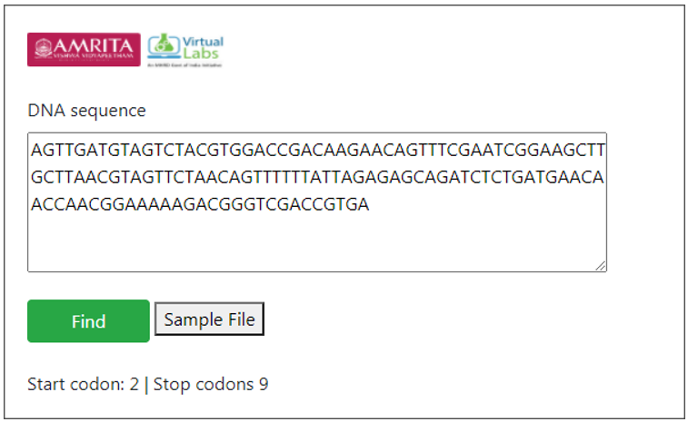

**Procedure to work the simulator**

&nbsp;
1.	Provide a DNA sequence in user interface for finding ORF. For example provide a hypothetical sequence.
 
                AGTTGATGTAGTCTACGTGGACCGACAAGAACAGTTTCGAATCG
                GAAGCTTGCTTAACGTAGTTCTAACAGTTTTTTATTAGAGAGCA
                GATCTCTGATGAACAACCAACGGAAAAAGACGGGTCGACCGTGA

     

2.	Click on Run button to execute simulation.

     

&nbsp;

3.	The number of start codon and stop codons in the given sequence is displayed as result. Start codon indicates the site for initiation of translation into protein sequence and the stop codon indicates the site for terminating translation process. 

&nbsp;
4.	A default sequence file is provided in the user interface. User can download the file and can use the file as query sequence for finding Start and Stop Codons

&nbsp;

The complete genome sequence of the particular organism is displayed as result. 

&nbsp;

**DIY**

**R code**

        library("stringr")
        findPotentialStartsAndStops<- function(sequence) # creating function
        {
&nbsp;

Define a vector with the sequences of potential start and stop codons
    
        codons<- c("atg", "taa", "tag", "tga")

&nbsp;
  
Find the number of occurrences of each type of potential start or stop codon
        
        for (i in 1:4)
        {
        codon<- codons[i]
    
&nbsp;
    
Find all occurrences of codon "codon" in sequence "sequence"

    occurrences<- as.data.frame(str_locate_all(sequence,codon))
    
&nbsp;

Find the start positions of all occurrences of "codon" in sequence "sequence"

        codonpositions<- c(occurrences[[1]])

&nbsp;
    
Find the total number of potential start and stop codons in sequence "sequence"

        numoccurrences<- length(codonpositions)
        if (i == 1){
      
&nbsp;
      
Make a copy of vector "codonpositions" called "positions"
        
        positions<- codonpositions
&nbsp;
      
Make a vector "types" containing "numoccurrences" copies of "codon"
        
        types<- rep(codon, numoccurrences)
        }
        else
        {
      
&nbsp;

Add the vector "codonpositions" to the end of vector "positions":
      
        positions<- append(positions, codonpositions,after=length(positions))
      

&nbsp;

Add the vector "rep(codon, numoccurrences)" to the end of vector "types":

        types<- append(types, rep(codon, numoccurrences),after=length(types))
        }
        }

&nbsp;

 
Sort the vectors "positions" and "types" in order of position along the input sequence:

        indices<- order(positions)
        positions<- positions[indices]
        types<- types[indices]
    
&nbsp;

Return a list variable including vectors "positions" and "types":
        
        mylist<- list(positions,types)
        return(mylist)
        }
        s1 <- "aaaatgcagtaacccatgccc"
        findPotentialStartsAndStops(s1)
